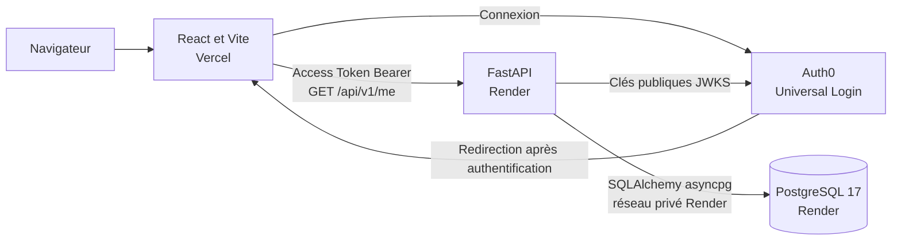

# Premier déploiement de Ndjoka Tontine

Cette procédure décrit le déploiement de l'application sur Vercel, Auth0,
Render Web Services et Render PostgreSQL. Elle couvre aussi le lancement local,
les migrations Alembic et les contrôles à effectuer après une nouvelle mise en
ligne.

> État de référence NDJ-21 au 31 août 2026. La base distante est une instance
> PostgreSQL 17 Free nommée `instance-postgres-ndjoka`.

## Architecture



Le navigateur charge le frontend statique depuis Vercel. Auth0 authentifie
l'utilisateur et remet un Access Token destiné à la Custom API. Le frontend
envoie ensuite ce token à FastAPI. Le backend vérifie sa signature RS256, son
issuer, son audience et son expiration, puis retrouve ou crée le profil Ndjoka
dans PostgreSQL avant de répondre.

## URLs de référence

| Service | Local | Distant |
| --- | --- | --- |
| Frontend | `http://localhost:5173` | `https://ndjoka-tontine.vercel.app` |
| Backend | `http://127.0.0.1:8000` | `https://api-ndjoka-tontine.onrender.com` |
| Documentation OpenAPI | `http://127.0.0.1:8000/docs` | `https://api-ndjoka-tontine.onrender.com/docs` |
| Health check | `http://127.0.0.1:8000/api/v1/health` | `https://api-ndjoka-tontine.onrender.com/api/v1/health` |
| Route protégée | `http://127.0.0.1:8000/api/v1/me` | `https://api-ndjoka-tontine.onrender.com/api/v1/me` |
| PostgreSQL | `127.0.0.1:5433/ndjoka_db` | URL interne Render, secrète et non publique |

L'audience Auth0 `https://api.ndjoka-tontine.com` est un identifiant logique.
Ce n'est pas l'URL réseau du backend Render.

## Prérequis

- Python `3.13.12`, fixé dans `backend/.python-version` ;
- [uv](https://docs.astral.sh/uv/) ;
- Docker avec Compose pour PostgreSQL 17 local ;
- Node.js `20.20.2` en local, fixé dans `frontend/.nvmrc` ;
- npm 10 ou supérieur.

Le projet accepte aussi les versions récentes de Node et le build Vercel
utilise Node `24.x`. La version locale reste fixée pour reproduire les
vérifications effectuées pendant ce premier déploiement.

## Lancement local

### Backend

Depuis la racine du dépôt :

```bash
cd infra
docker compose up -d postgres
cd ../backend
# Exécuter la copie uniquement si .env.dev n'existe pas déjà.
cp -n .env.example .env.dev
uv sync
uv run alembic upgrade head
uv run uvicorn app.main:app --reload
```

Compléter `.env.dev` avec les valeurs du tenant Auth0 avant le lancement. Le
backend répond alors sur `http://127.0.0.1:8000`.

Contrôles backend :

```bash
uv run ruff check .
uv run ruff format --check .
uv run pytest -v
```

### Frontend

Dans un autre terminal, depuis la racine du dépôt :

Si `nvm` est installé, exécuter d'abord `nvm use` dans `frontend/`.

```bash
cd frontend
# Exécuter la copie uniquement si .env.dev n'existe pas déjà.
cp -n .env.example .env.dev
npm ci
npm run dev
```

Compléter `.env.dev`, puis ouvrir `http://localhost:5173`.

Contrôles frontend :

```bash
npm run lint
npm run build
```

Le script `npm run build` utilise le mode Vite `prod`. Pour valider localement
le vrai bundle de production, créer aussi `frontend/.env.prod` s'il n'existe
pas, y configurer les quatre variables `VITE_*`, puis relancer le build. Ce
fichier reste ignoré par Git.

Un changement de variable `VITE_*` sur Vercel n'affecte que les nouveaux
déploiements : il faut redéployer le frontend après la modification.

## Ordre de déploiement

1. Créer PostgreSQL 17 sur Render dans le même environnement et la même région
   que FastAPI.
2. Appliquer les migrations Alembic avec l'URL externe, puis retirer l'accès
   externe devenu inutile.
3. Configurer l'URL interne de PostgreSQL dans `DATABASE_URL` sur le Web
   Service FastAPI et déployer le backend.
4. Relever l'URL `onrender.com` réellement attribuée et la configurer dans
   `VITE_API_BASE_URL`, puis déployer React sur Vercel.
5. Relever le domaine Vercel de production réellement attribué.
6. Ajouter ce domaine dans les URLs autorisées de l'application Auth0 et dans
   `CORS_ALLOWED_ORIGINS` sur Render.
7. Tester la connexion, la création ou lecture du profil PostgreSQL et la
   déconnexion depuis le domaine Vercel stable.

## Déploiement du backend sur Render

Créer un **Web Service** avec la configuration suivante :

| Réglage | Valeur |
| --- | --- |
| Service | `api-ndjoka-tontine` |
| Branche | `develop` |
| Root Directory | `backend` |
| Runtime | Python |
| Instance | Free |
| Build Command | `uv sync --locked --no-dev` |
| Start Command | `uv run --no-sync uvicorn app.main:app --host 0.0.0.0 --port $PORT` |
| Health Check Path | `/api/v1/health` |

La version Python est fixée dans `backend/.python-version`. Render fournit la
variable `PORT` ; elle ne doit pas être remplacée par un port fixe. Sur l'offre
Free, conserver Alembic hors des commandes Build et Start : une migration
explicite évite de modifier la base à chaque build, redémarrage ou réveil.

### PostgreSQL Render

L'instance `instance-postgres-ndjoka` doit utiliser PostgreSQL 17 et se trouver
dans le même workspace, le même environnement et la même région que le Web
Service. Render fournit deux URLs différentes :

- l'**External Database URL**, réservée aux migrations ponctuelles depuis un
  poste autorisé ;
- l'**Internal Database URL**, utilisée en permanence par FastAPI sur le réseau
  privé Render.

Ne jamais recopier l'une de ces URLs dans Git, une capture publique ou un
ticket : elles contiennent les identifiants PostgreSQL.

### Variables Render

```dotenv
APP_ENV=prod
AUTH0_DOMAIN=dev-rjei6nu4xfpxilgo.us.auth0.com
AUTH0_AUDIENCE=https://api.ndjoka-tontine.com
CORS_ALLOWED_ORIGINS=["http://localhost:5173","https://ndjoka-tontine.vercel.app"]
DATABASE_URL=<INTERNAL_DATABASE_URL_DE_INSTANCE_POSTGRES_NDJOKA>
```

`AUTH0_DOMAIN` ne contient ni protocole ni barre finale. La valeur CORS est une
liste JSON, pas une liste CSV. Aucun Client Secret Auth0 n'est nécessaire pour
la validation d'un Access Token RS256. `DATABASE_URL` doit être la valeur
**Internal Database URL** copiée depuis Render. Le code convertit
automatiquement les schémas `postgres://` et `postgresql://` vers le pilote
`asyncpg` ; il ne faut pas modifier manuellement la valeur dans le Dashboard.

Après une modification de variable Render, enregistrer les changements et
attendre la fin du nouveau déploiement avant de tester le CORS ou l'API.

### Migration initiale sur l'offre Free

Le Pre-Deploy Command Render est réservé aux services payants. Pour cette
instance Free, appliquer la migration depuis `backend/` avec l'External
Database URL. La commande `read -s` évite d'afficher le secret et de l'inscrire
directement dans la ligne de commande :

```zsh
uv sync --locked
read -s "DATABASE_URL?Collez l'External Database URL Render : "
echo
export DATABASE_URL
uv run --no-sync alembic upgrade head
uv run --no-sync alembic current
uv run --no-sync alembic check
unset DATABASE_URL
```

Résultats attendus :

```text
d94b607046b8 (head)
No new upgrade operations detected.
```

L'URL externe Render peut contenir `sslmode=require`. La configuration la
convertit en `ssl=require`, forme attendue par le dialecte SQLAlchemy
`asyncpg`, sans exposer ni altérer le mot de passe.

Autoriser uniquement l'adresse IP du poste pendant cette opération. Après la
migration, retirer cet accès externe ou conserver une liste d'IP minimale.
L'accès interne du Web Service n'est pas affecté. Pour chaque future migration,
répéter cette procédure tant que le service reste Free. Après passage à une
offre payante, exécuter `uv run --no-sync alembic upgrade head` dans le
Pre-Deploy Command Render.

## Déploiement du frontend sur Vercel

Importer le même dépôt Git avec la configuration suivante :

| Réglage | Valeur |
| --- | --- |
| Projet | `ndjoka-tontine` |
| Production Branch | `develop` |
| Root Directory | `frontend` |
| Framework Preset | Vite |
| Node.js | `24.x` |
| Build Command | `npm run build` |
| Output Directory | `dist` |
| Install Command | `npm install` (détection automatique via `package-lock.json`) |

Le dépôt contient aussi une branche `main`, mais elle ne contient pas encore
l'application. Tant que cette organisation ne change pas, Vercel et Render
doivent donc suivre `develop`.

### Variables Vercel de production

```dotenv
VITE_AUTH0_DOMAIN=dev-rjei6nu4xfpxilgo.us.auth0.com
VITE_AUTH0_CLIENT_ID=<CLIENT_ID_DE_L_APPLICATION_SPA_AUTH0>
VITE_AUTH0_AUDIENCE=https://api.ndjoka-tontine.com
VITE_API_BASE_URL=https://api-ndjoka-tontine.onrender.com
```

Récupérer le Client ID dans **Auth0 > Applications > Ndjoka Tontine Web >
Settings > Client ID**. Enregistrer les variables pour l'environnement
Production, puis créer un nouveau déploiement Vercel.

Les variables préfixées par `VITE_` sont incorporées au bundle servi au
navigateur et sont donc publiques. Ne jamais y placer de Client Secret, token
privé ou mot de passe. Les fichiers locaux `.env.dev` et `.env.prod` ne doivent
pas être envoyés sur Git.

Les déploiements Preview utilisent un autre domaine. Le flux Auth0 n'est garanti
que sur le domaine de production stable ci-dessus, sauf si chaque domaine de
Preview est explicitement autorisé dans Auth0 et dans le CORS Render.

## Configuration Auth0

Dans l'application **Ndjoka Tontine Web**, de type **Single Page
Application**, conserver localhost et ajouter le domaine Vercel stable.

```text
Allowed Callback URLs:
http://localhost:5173, https://ndjoka-tontine.vercel.app

Allowed Logout URLs:
http://localhost:5173, https://ndjoka-tontine.vercel.app

Allowed Web Origins:
http://localhost:5173, https://ndjoka-tontine.vercel.app
```

Dans la Custom API Auth0, conserver :

```text
Identifier: https://api.ndjoka-tontine.com
Signing Algorithm: RS256
```

Les URLs doivent correspondre exactement aux origines utilisées. Ne pas ajouter
l'URL Render comme Callback URL : Auth0 redirige l'utilisateur vers le
frontend, pas vers l'API.

## Procédure de validation

### Contrôles HTTP publics

Vérifier le frontend et le health check :

```bash
curl -I https://ndjoka-tontine.vercel.app
curl -i https://api-ndjoka-tontine.onrender.com/api/v1/health
```

Résultats attendus : statut `200` et réponse `{"status":"ok"}` pour le health
check.

Vérifier que la route protégée refuse une requête anonyme :

```bash
curl -i https://api-ndjoka-tontine.onrender.com/api/v1/me
```

Résultat attendu : statut `401`, en-tête `WWW-Authenticate: Bearer` et détail
`Authentification requise`.

Vérifier le CORS Vercel vers Render :

```bash
curl -i -X OPTIONS \
  https://api-ndjoka-tontine.onrender.com/api/v1/me \
  -H 'Origin: https://ndjoka-tontine.vercel.app' \
  -H 'Access-Control-Request-Method: GET' \
  -H 'Access-Control-Request-Headers: Authorization'
```

Résultat attendu : statut `200` et en-tête :

```text
Access-Control-Allow-Origin: https://ndjoka-tontine.vercel.app
```

### Contrôle fonctionnel dans le navigateur

1. Ouvrir `https://ndjoka-tontine.vercel.app`.
2. Cliquer sur **Se connecter**.
3. Terminer l'authentification sur Universal Login Auth0.
4. Vérifier le retour vers le domaine Vercel stable.
5. Vérifier l'affichage **API protégée accessible**, de l'UUID Ndjoka et du
   `sub` Auth0. Ce message confirme que `GET /api/v1/me` a validé le token,
   accédé à la table `users` et retrouvé ou créé le profil local.
6. Actualiser la page et vérifier que le même UUID est retourné : aucune ligne
   utilisateur supplémentaire ne doit être créée pour le même `sub`.
7. Cliquer sur **Se déconnecter** et vérifier le retour à l'état déconnecté.

Le health check `200` et le refus anonyme `401` ne suffisent pas à prouver la
connexion PostgreSQL : le premier n'interroge pas la base et le second échoue
avant l'ouverture d'une session. La réponse authentifiée de `/api/v1/me` est le
contrôle fonctionnel distant de bout en bout.

## Limites de l'offre Render Free

- Un Web Service Free est mis en veille après 15 minutes sans trafic entrant.
- La première requête suivante le réveille ; le redémarrage prend environ une
  minute. Le frontend peut temporairement afficher une erreur FastAPI : attendre
  le réveil puis cliquer sur **Réessayer**.
- Le système de fichiers est éphémère. Les fichiers créés par le service sont
  perdus lors d'un redéploiement, redémarrage ou passage en veille.
- Un espace Render dispose de 750 heures d'instance Free par mois. Une fois le
  quota consommé, les services Free sont suspendus jusqu'au mois suivant.
- La bande passante sortante et les minutes de build consomment les quotas
  mensuels du workspace. En cas de dépassement, Render facture si un moyen de
  paiement est configuré ; sinon le service ou les nouveaux builds peuvent
  être suspendus jusqu'au mois suivant.
- Un Web Service Free ne prend pas en charge les disques persistants, le
  scaling au-delà d'une instance ni l'accès Shell SSH ou Dashboard.
- Render peut redémarrer un service Free à tout moment. Cette offre convient à
  la démonstration et au développement, pas à une production exigeant une
  disponibilité constante.
- Une seule base PostgreSQL Free est disponible par workspace. Elle est limitée
  à 1 Go, ne fournit ni sauvegardes ni pooling géré et expire après 30 jours.
- L'instance `instance-postgres-ndjoka` affiche actuellement une expiration au
  **24 septembre 2026**. Après expiration, Render accorde une période de grâce
  limitée avant suppression ; les données de démonstration ne doivent pas être
  considérées comme sauvegardées.

## Diagnostic rapide

| Symptôme | Cause probable | Correction |
| --- | --- | --- |
| `Callback URL mismatch` | Domaine absent des URLs Auth0 | Ajouter l'origine exacte dans Callback, Logout et Web Origins |
| `Failed to fetch` en local | FastAPI local arrêté | Lancer Uvicorn sur `127.0.0.1:8000` |
| `Failed to fetch` sur Vercel | Render en veille ou origine CORS absente | Attendre le réveil, puis contrôler `CORS_ALLOWED_ORIGINS` |
| `401 Unauthorized` avec un token | Audience, issuer, expiration ou signature invalide | Comparer les configurations Auth0 frontend et backend |
| `/me` renvoie `500` après authentification | `DATABASE_URL` absente, URL externe utilisée sur le service ou migration non appliquée | Configurer l'URL interne, exécuter `alembic current`, puis redéployer |
| `sslmode` est refusé par `asyncpg` | Ancienne version du code sans normalisation de l'URL externe | Déployer la version NDJ-21 puis relancer Alembic avec l'URL Render brute |
| `404 NOT_FOUND` sur Vercel | Mauvaise branche ou mauvais Root Directory | Utiliser `develop` et `frontend` |
| Variables Vercel ignorées | Déploiement antérieur au changement | Créer un nouveau déploiement de production |

## Gestion des secrets

- Versionner uniquement `backend/.env.example` et `frontend/.env.example`.
- Garder `.env.dev` et `.env.prod` hors de Git.
- Ne jamais stocker d'Access Token, Client Secret, mot de passe ou clé privée
  dans le dépôt.
- Conserver les URLs PostgreSQL uniquement dans les variables masquées Render
  ou, le temps d'une migration, dans une variable de terminal ensuite supprimée.
- Le backend valide les JWT avec les clés publiques JWKS ; il n'a pas besoin du
  Client Secret de l'application Auth0.
- Les valeurs `VITE_*` sont publiques, même lorsqu'elles sont configurées dans
  le tableau de bord Vercel.

## Références officielles

- [Render : Web Services](https://render.com/docs/web-services)
- [Render : créer et connecter PostgreSQL](https://render.com/docs/postgresql-creating-connecting)
- [Render : cycle des déploiements et Pre-Deploy Command](https://render.com/docs/deploys)
- [Render : limites des services gratuits](https://render.com/docs/free)
- [Vercel : déployer une application Vite](https://vercel.com/docs/frameworks/frontend/vite)
- [Vercel : variables d'environnement](https://vercel.com/docs/environment-variables)
- [Auth0 : paramètres d'une application](https://auth0.com/docs/get-started/applications/application-settings)
