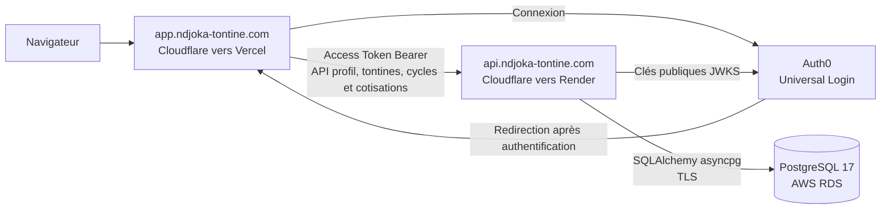

# Premier déploiement de Ndjoka Tontine

Cette procédure décrit le déploiement de l'application sur Vercel, Auth0,
Render Web Services et AWS RDS PostgreSQL, avec les domaines publics gérés dans
Cloudflare. Elle couvre aussi le lancement local, les migrations Alembic et les
contrôles à effectuer après une nouvelle mise en ligne.

> Version backend cible v0.9.0 (Sprint 8, NDJ-126 à NDJ-136). Cette documentation
> ne constitue pas une attestation de déploiement : migration et recette distantes
> restent à effectuer par le mainteneur. La base distante décrite ci-dessous
> est une instance PostgreSQL 17 AWS RDS ; vérifier la cible effective de
> `DATABASE_URL` avant toute migration (ne pas confondre hébergeur API et DB).

## Architecture


```mermaid
flowchart LR
    browser[Navigateur]
    frontend[app.ndjoka-tontine.com<br/>Cloudflare vers Vercel]
    auth[Auth0<br/>Universal Login]
    backend[api.ndjoka-tontine.com<br/>Cloudflare vers Render]
    database[(PostgreSQL 17<br/>AWS RDS)]

    browser --> frontend
    frontend -->|Connexion| auth
    auth -->|Redirection après authentification| frontend
    frontend -->|Access Token Bearer<br/>API profil, tontines, cycles et cotisations| backend
    backend -->|Clés publiques JWKS| auth
    backend -->|SQLAlchemy asyncpg<br/>TLS| database
```

Le navigateur charge le frontend statique depuis Vercel. Auth0 authentifie
l'utilisateur et remet un Access Token destiné à la Custom API. Le frontend
envoie ensuite ce token à FastAPI. Le backend vérifie sa signature RS256, son
issuer, son audience et son expiration, puis retrouve ou crée le profil Ndjoka
dans PostgreSQL avant de répondre.

## URLs de référence

| Service | Local | Distant |
| --- | --- | --- |
| Frontend | `http://localhost:5173` | `https://app.ndjoka-tontine.com` |
| Backend | `http://127.0.0.1:8000` | `https://api.ndjoka-tontine.com` |
| Documentation OpenAPI | `http://127.0.0.1:8000/docs` | `https://api.ndjoka-tontine.com/docs` |
| Health check | `http://127.0.0.1:8000/api/v1/health` | `https://api.ndjoka-tontine.com/api/v1/health` |
| Profil courant | `http://127.0.0.1:8000/api/v1/me` | `https://api.ndjoka-tontine.com/api/v1/me` |
| Administration utilisateurs | `http://127.0.0.1:8000/api/v1/admin/users` | `https://api.ndjoka-tontine.com/api/v1/admin/users` |
| PostgreSQL | `127.0.0.1:5433/ndjoka_db` | Endpoint AWS RDS, secret et protégé par Security Group |

L'audience Auth0 `https://api.ndjoka-tontine.com` reste l'identifiant logique de
la Custom API. Elle coïncide désormais avec l'URL publique choisie pour le
backend, mais Auth0 et FastAPI continuent de l'utiliser comme identifiant exact
du destinataire des Access Tokens.

Les sous-domaines techniques générés par Vercel et Render sont volontairement
désactivés. Les tests, les callbacks Auth0, le CORS et les variables de
production doivent toujours utiliser les deux domaines Cloudflare stables
ci-dessus.

## Prérequis

- Python `3.13.12`, fixé dans `backend/.python-version` ;
- [uv](https://docs.astral.sh/uv/) ;
- Docker avec Compose pour PostgreSQL 17 local ;
- Node.js `20.20.2` en local, fixé dans `frontend/.nvmrc` ;
- npm 10 ou supérieur.

Le projet accepte aussi les versions récentes de Node et le build Vercel
utilise Node `24.x`. La version locale reste fixée pour reproduire les
vérifications effectuées pendant ce premier déploiement.

## Lancement local

### Backend

Depuis la racine du dépôt :

```bash
cd infra
# Exécuter la copie uniquement si infra/.env n'existe pas déjà.
cp -n .env.example .env
# Adapter POSTGRES_PASSWORD dans infra/.env avant le premier démarrage.
docker compose up -d postgres
cd ../backend
# Exécuter la copie uniquement si .env.dev n'existe pas déjà.
cp -n .env.example .env.dev
uv sync
uv run alembic upgrade head
uv run uvicorn app.main:app --reload
```

Compléter `.env.dev` avec les valeurs du tenant Auth0 avant le lancement et y
reporter le même mot de passe PostgreSQL que dans `infra/.env`. Le backend
répond alors sur `http://127.0.0.1:8000`.

Contrôles backend :

```bash
uv run ruff check .
uv run ruff format --check .
uv run pytest -v
```

### Frontend

Dans un autre terminal, depuis la racine du dépôt :

Si `nvm` est installé, exécuter d'abord `nvm use` dans `frontend/`.

```bash
cd frontend
# Exécuter la copie uniquement si .env.dev n'existe pas déjà.
cp -n .env.example .env.dev
npm ci
npm run dev
```

Compléter `.env.dev`, puis ouvrir `http://localhost:5173`.

Contrôles frontend :

```bash
npm run lint
npm run build
```

Le script `npm run build` utilise le mode Vite `prod`. Pour valider localement
le vrai bundle de production, créer aussi `frontend/.env.prod` s'il n'existe
pas, y configurer les quatre variables `VITE_*`, puis relancer le build. Ce
fichier reste ignoré par Git.

Un changement de variable `VITE_*` sur Vercel n'affecte que les nouveaux
déploiements : il faut redéployer le frontend après la modification.

## Ordre de déploiement

1. Créer PostgreSQL 17 sur AWS RDS et autoriser TCP `5432` depuis Render et
  temporairement depuis le poste de migration.
2. Appliquer toutes les migrations Alembic avec l'URL RDS.
3. Configurer l'URL RDS dans `DATABASE_URL` sur le Web Service FastAPI et
  déployer le backend.
4. Configurer et vérifier `api.ndjoka-tontine.com` dans Cloudflare et Render.
5. Configurer cette URL dans `VITE_API_BASE_URL`, puis déployer React sur
   Vercel derrière `app.ndjoka-tontine.com`.
6. Ajouter `https://app.ndjoka-tontine.com` dans les URLs autorisées de
  l'application Auth0 et dans `CORS_ALLOWED_ORIGINS` sur Render.
7. Se connecter une première fois pour provisionner le profil local, puis
   désigner explicitement le premier `platform_admin` par son `auth0_sub`
   exact selon la procédure ci-dessous.
8. Retirer l'accès PostgreSQL externe devenu inutile et, après validation des
   domaines personnalisés, désactiver les domaines techniques Vercel et Render
   si cette restriction est souhaitée.
9. Tester le profil, sa modification, les contrôles de statut et de rôle, puis
   la déconnexion depuis `https://app.ndjoka-tontine.com`.

## Déploiement du backend sur Render

Créer un **Web Service** avec la configuration suivante :

| Réglage | Valeur |
| --- | --- |
| Service | `api-ndjoka-tontine` |
| Branche | `develop` |
| Root Directory | `backend` |
| Runtime | Python |
| Instance | Free |
| Build Command | `uv sync --locked --no-dev` |
| Start Command | `uv run --no-sync uvicorn app.main:app --host 0.0.0.0 --port $PORT` |
| Health Check Path | `/api/v1/health` |
| Domaine public | `api.ndjoka-tontine.com` via Cloudflare |

La version Python est fixée dans `backend/.python-version`. Render fournit la
variable `PORT` ; elle ne doit pas être remplacée par un port fixe. Sur l'offre
Free, conserver Alembic hors des commandes Build et Start : une migration
explicite évite de modifier la base à chaque build, redémarrage ou réveil.

### PostgreSQL AWS RDS

L'instance RDS doit utiliser PostgreSQL 17 et se trouver dans une région proche
du Web Service. Son Security Group doit autoriser TCP `5432` depuis Render et,
pour les migrations ponctuelles, depuis l'IP publique du poste autorisé.

Ne recopiez jamais l'URL RDS dans Git, une capture publique ou un ticket : elle
contient les identifiants PostgreSQL.

### Variables Render

```dotenv
APP_ENV=prod
AUTH0_DOMAIN=dev-rjei6nu4xfpxilgo.us.auth0.com
AUTH0_AUDIENCE=https://api.ndjoka-tontine.com
CORS_ALLOWED_ORIGINS=["http://localhost:5173","https://app.ndjoka-tontine.com"]
DATABASE_URL=postgresql+asyncpg://<utilisateur>:<mot-de-passe-encode>@<hote-rds>:5432/ndjoka_db?ssl=require
GROQ_API_KEY=<cle-groq-prod>
```

`AUTH0_DOMAIN` ne contient ni protocole ni barre finale. La valeur CORS est une
liste JSON, pas une liste CSV. Aucun Client Secret Auth0 n'est nécessaire pour
la validation d'un Access Token RS256. `DATABASE_URL` doit utiliser l'endpoint
RDS et `ssl=require`. Le code convertit automatiquement les schémas
`postgres://` et `postgresql://` vers le pilote `asyncpg`.

Après une modification de variable Render, enregistrer les changements et
attendre la fin du nouveau déploiement avant de tester le CORS ou l'API.

### Migrations Alembic AWS RDS

Appliquer les migrations depuis `backend/` avec l'URL RDS. La commande `read
-s` évite d'afficher le secret et de l'inscrire directement dans la ligne de
commande :

```zsh
uv sync --locked
read -s "DATABASE_URL?Collez l'URL AWS RDS : "
echo
export DATABASE_URL
uv run --no-sync alembic upgrade head
uv run --no-sync alembic current
uv run --no-sync alembic check
unset DATABASE_URL
```

Résultats attendus :

```text
a91c4e7d2b60 (head)
No new upgrade operations detected.
```

La révision `3b9f4c2a7d11` enrichit la table `users`, convertit les anciens
statuts `pending`/`closed` en `suspended`/`deactivated` et ajoute les
contraintes de rôle et de statut de la version 0.2.0. La révision Sprint 2
`7c2a91e4b630` crée la table `tontines`. La révision Sprint 3
`b81e6c3d4f20` crée les adhésions et invitations et attribue automatiquement
le rôle `owner` aux créateurs des tontines existantes. La révision Sprint 4
`c42a8e0f6b17` crée les cycles et leurs tours ; la révision Sprint 5
`d53b9f1a7c28` crée les obligations de cotisation et `e64ca02b8d39` crée les
versements manuels. La révision Sprint 7 `f75db14c9a20` crée l'audit métier
append-only et son trigger d'immuabilité. La révision Sprint 8
`a91c4e7d2b60` crée les quatre tables Notifications,
Outbox, livraisons e-mail et webhooks. Contrôler le résultat de
`alembic current` avant de redéployer FastAPI.

L'URL RDS doit contenir `ssl=require`, forme attendue par le dialecte
SQLAlchemy `asyncpg`, sans exposer ni altérer le mot de passe.

Autoriser uniquement l'adresse IP du poste pendant cette opération. Après la
migration, retirer cet accès externe ou conserver une liste d'IP minimale. Pour
chaque future migration, répéter cette procédure.

### Désigner le premier administrateur de plateforme

La migration ne promeut aucun compte automatiquement. Procéder ainsi :

1. déployer la version migrée et se connecter une première fois avec le compte
   du mainteneur afin que `/api/v1/me` crée sa ligne locale ;
2. relever son `auth0_sub` exact dans la réponse de `/api/v1/me` ;
3. autoriser temporairement l'IP du poste sur PostgreSQL RDS ;
4. ouvrir `psql` avec l'URL RDS sans inscrire cette URL dans
   l'historique du terminal :

```zsh
read -s "RDS_DATABASE_URL?Collez l'URL AWS RDS : "
echo
psql "$RDS_DATABASE_URL"
```

Dans `psql`, remplacer uniquement la valeur d'exemple par le `sub` complet,
y compris son préfixe fournisseur (`auth0|`, `google-oauth2|`, etc.), puis
exécuter :

```sql
UPDATE users
SET global_role = 'platform_admin', updated_at = CURRENT_TIMESTAMP
WHERE auth0_sub = 'auth0|IDENTIFIANT_EXACT';

SELECT auth0_sub, global_role
FROM users
WHERE auth0_sub = 'auth0|IDENTIFIANT_EXACT';
```

La première commande doit répondre exactement `UPDATE 1` et la sélection doit
retourner le même `auth0_sub` avec `platform_admin`. Si le résultat est
`UPDATE 0`, ne pas élargir la clause `WHERE` : vérifier d'abord que le compte a
bien appelé `/api/v1/me` et que le `sub` a été recopié sans modification.
Quitter ensuite avec `\q`, exécuter `unset RDS_DATABASE_URL` et retirer de
nouveau l'accès réseau externe.

Un `platform_admin` ne peut pas changer son propre statut ou son propre rôle
par l'API. Pour corriger exceptionnellement le seul compte administrateur,
utiliser la même procédure SQL contrôlée et conserver une trace opérationnelle
de la modification.

## Déploiement du frontend sur Vercel

Importer le même dépôt Git avec la configuration suivante :

| Réglage | Valeur |
| --- | --- |
| Projet | `ndjoka-tontine` |
| Production Branch | `develop` |
| Root Directory | `frontend` |
| Framework Preset | Vite |
| Node.js | `24.x` |
| Build Command | `npm run build` |
| Output Directory | `dist` |
| Install Command | `npm install` (détection automatique via `package-lock.json`) |
| Domaine public | `app.ndjoka-tontine.com` via Cloudflare |

Le dépôt contient aussi une branche `main`, mais elle ne contient pas encore
l'application. Tant que cette organisation ne change pas, Vercel et Render
doivent donc suivre `develop`.

### Variables Vercel de production

```dotenv
VITE_AUTH0_DOMAIN=dev-rjei6nu4xfpxilgo.us.auth0.com
VITE_AUTH0_CLIENT_ID=<CLIENT_ID_DE_L_APPLICATION_SPA_AUTH0>
VITE_AUTH0_AUDIENCE=https://api.ndjoka-tontine.com
VITE_API_BASE_URL=https://api.ndjoka-tontine.com
```

Récupérer le Client ID dans **Auth0 > Applications > Ndjoka Tontine Web >
Settings > Client ID**. Enregistrer les variables pour l'environnement
Production, puis créer un nouveau déploiement Vercel.

Les variables préfixées par `VITE_` sont incorporées au bundle servi au
navigateur et sont donc publiques. Ne jamais y placer de Client Secret, token
privé ou mot de passe. Les fichiers locaux `.env.dev` et `.env.prod` ne doivent
pas être envoyés sur Git.

Les déploiements Preview utilisent un autre domaine. Le flux Auth0 n'est garanti
que sur le domaine de production stable ci-dessus, sauf si chaque domaine de
Preview est explicitement autorisé dans Auth0 et dans le CORS Render.

## Configuration Auth0

Dans l'application **Ndjoka Tontine Web**, de type **Single Page
Application**, conserver localhost et ajouter le domaine personnalisé stable.

```text
Allowed Callback URLs:
http://localhost:5173, https://app.ndjoka-tontine.com

Allowed Logout URLs:
http://localhost:5173, https://app.ndjoka-tontine.com

Allowed Web Origins:
http://localhost:5173, https://app.ndjoka-tontine.com
```

Dans la Custom API Auth0, conserver :

```text
Identifier: https://api.ndjoka-tontine.com
Signing Algorithm: RS256
```

Les URLs doivent correspondre exactement aux origines utilisées. Ne pas ajouter
`https://api.ndjoka-tontine.com` comme Callback URL : Auth0 redirige
l'utilisateur vers le frontend, pas vers l'API.

## Procédure de validation

### Contrôles HTTP publics

Vérifier le frontend et le health check :

```bash
curl -I https://app.ndjoka-tontine.com
curl -i https://api.ndjoka-tontine.com/api/v1/health
```

Résultats attendus : statut `200` et réponse `{"status":"ok"}` pour le health
check.

Vérifier ensuite que le schéma OpenAPI déployé correspond à la version 0.9.0 :

```bash
curl -fsS https://api.ndjoka-tontine.com/openapi.json \
  | python -c 'import json,sys; d=json.load(sys.stdin); print(d["info"]["version"]); print("\n".join(sorted(d["paths"])))'
```

La sortie doit annoncer `0.9.0` et contenir les routes `/api/v1/payouts/{payout_id}`,
`/api/v1/me/payouts`, `/api/v1/me`,
`/api/v1/me/deactivate`, `/api/v1/admin/users`,
`/api/v1/admin/users/{user_id}`, `/api/v1/admin/users/{user_id}/status` et
`/api/v1/admin/users/{user_id}/role`, ainsi que `/api/v1/tontines`,
`/api/v1/tontines/{tontine_id}` et
`/api/v1/tontines/{tontine_id}/archive`, les routes `/members`,
`/invitations` et `/ownership-transfer`, ainsi que les routes `/cycles`,
`/turns` et `/contributions`, plus `/api/v1/me/notifications` et
`/api/v1/webhooks/resend`. Ouvrir également
`https://api.ndjoka-tontine.com/docs` pour contrôler les schémas de réponse,
les paramètres de pagination et le cadenas Bearer de chaque route métier.

Vérifier que la route protégée refuse une requête anonyme :

```bash
curl -i https://api.ndjoka-tontine.com/api/v1/me
```

Résultat attendu : statut `401`, en-tête `WWW-Authenticate: Bearer` et détail
`Authentification requise`.

Vérifier d'abord le CORS de lecture Vercel vers Render :

```bash
curl -i -X OPTIONS \
  https://api.ndjoka-tontine.com/api/v1/me \
  -H 'Origin: https://app.ndjoka-tontine.com' \
  -H 'Access-Control-Request-Method: GET' \
  -H 'Access-Control-Request-Headers: Authorization'
```

Résultat attendu : statut `200` et en-tête :

```text
Access-Control-Allow-Origin: https://app.ndjoka-tontine.com
```

Contrôler également les requêtes préliminaires des écritures JSON ajoutées au
Sprint 1 :

```bash
curl -i -X OPTIONS \
  https://api.ndjoka-tontine.com/api/v1/me \
  -H 'Origin: https://app.ndjoka-tontine.com' \
  -H 'Access-Control-Request-Method: PATCH' \
  -H 'Access-Control-Request-Headers: Authorization, Content-Type'

curl -i -X OPTIONS \
  https://api.ndjoka-tontine.com/api/v1/me/deactivate \
  -H 'Origin: https://app.ndjoka-tontine.com' \
  -H 'Access-Control-Request-Method: POST' \
  -H 'Access-Control-Request-Headers: Authorization'
```

Les deux réponses doivent être `200`, contenir l'origine personnalisée exacte
et autoriser la méthode et les en-têtes demandés.

### Contrôles authentifiés de l'API v0.8.0

Utiliser un Access Token temporaire destiné à l'audience
`https://api.ndjoka-tontine.com`. Le conserver uniquement dans le terminal,
ne jamais le placer dans un fichier ou un ticket :

```zsh
read -s "ACCESS_TOKEN?Collez un Access Token Auth0 de test : "
echo
export ACCESS_TOKEN

curl -i https://api.ndjoka-tontine.com/api/v1/me \
  -H "Authorization: Bearer $ACCESS_TOKEN"

curl -i -X PATCH https://api.ndjoka-tontine.com/api/v1/me \
  -H "Authorization: Bearer $ACCESS_TOKEN" \
  -H 'Content-Type: application/json' \
  --data '{"display_name":"Profil de démonstration","locale":"fr","timezone":"Europe/Paris"}'

unset ACCESS_TOKEN
```

Les deux appels doivent répondre `200`, garder le même UUID et refléter le
profil modifié. Un champ interdit tel que `global_role` envoyé à `PATCH /me`
doit produire `422`. Ne déclencher `POST /me/deactivate` qu'avec un compte de
test prévu pour cela : l'appel est logique mais bloque immédiatement les
routes métier de ce compte avec `403`.

Les routes d'administration sont visibles dans OpenAPI :

- `GET /api/v1/admin/users?limit=50&offset=0&status=active&global_role=user`
  répond `200` pour `support` et `platform_admin`, mais `403` pour `user` ;
- les deux routes `PATCH .../status` et `PATCH .../role` répondent `200`
  uniquement pour `platform_admin` ;
- une cible UUID inconnue répond `404`, une charge invalide `422` et une
  tentative de modifier son propre statut ou rôle `403` ;
- `deactivated_at` est réécrit lors de chaque désactivation et reste présent
  comme historique après une réactivation ou une suspension administrative.

Tester ensuite le parcours Tontines avec le même token :

```zsh
read -s "ACCESS_TOKEN?Collez un Access Token Auth0 de test : "
echo
export ACCESS_TOKEN

curl -i -X POST https://api.ndjoka-tontine.com/api/v1/tontines \
  -H "Authorization: Bearer $ACCESS_TOKEN" \
  -H 'Content-Type: application/json' \
  --data '{"name":"Tontine de démonstration","currency":"EUR","max_members":8}'

curl -i 'https://api.ndjoka-tontine.com/api/v1/tontines?limit=20&offset=0' \
  -H "Authorization: Bearer $ACCESS_TOKEN"

unset ACCESS_TOKEN
```

La création doit répondre `201` avec `status=draft` et un en-tête `Location`.
La liste doit répondre `200` et ne contenir que les tontines dont le compte est
membre actif. Utiliser
l'UUID retourné pour tester `GET`, `PATCH` et `POST .../archive`. Après
archivage, la lecture reste possible et une modification répond `409`.

Pour valider les membres et invitations, utiliser deux comptes Auth0 de test
ayant chacun un claim `email`. Avec le token du propriétaire et l'UUID de la
tontine :

```zsh
read -s "OWNER_TOKEN?Access Token du propriétaire : "
echo
export OWNER_TOKEN

curl -i -X POST \
  "https://api.ndjoka-tontine.com/api/v1/tontines/$TONTINE_ID/invitations" \
  -H "Authorization: Bearer $OWNER_TOKEN" \
  -H 'Content-Type: application/json' \
  --data '{"email":"membre@example.com","role":"member"}'
```

Copier le champ `token` de cette réponse `201` sans le publier. Il ne sera plus
retourné par la route de liste. Avec le compte invité connecté :

```zsh
read -s "MEMBER_TOKEN?Access Token du membre invité : "
echo
read -s "INVITATION_TOKEN?Token brut de l'invitation : "
echo
export MEMBER_TOKEN INVITATION_TOKEN

curl -i -X POST \
  https://api.ndjoka-tontine.com/api/v1/invitations/accept \
  -H "Authorization: Bearer $MEMBER_TOKEN" \
  -H 'Content-Type: application/json' \
  --data "{\"token\":\"$INVITATION_TOKEN\"}"

curl -i \
  "https://api.ndjoka-tontine.com/api/v1/tontines/$TONTINE_ID/members" \
  -H "Authorization: Bearer $MEMBER_TOKEN"

unset OWNER_TOKEN MEMBER_TOKEN INVITATION_TOKEN TONTINE_ID
```

L'acceptation doit répondre `200`, puis la liste des membres doit contenir un
`owner` et le nouveau `member`. Vérifier aussi qu'un second usage du même token
répond `409`, qu'un membre ne peut pas modifier la tontine (`403`) et qu'après
un retrait sa consultation renvoie `404`.

### Recette Sprint 6 sans frontend

La migration attendue est `e64ca02b8d39`. Aucune variable d'environnement
supplémentaire n'est nécessaire. Pour les anciens cycles actifs ou terminés,
un owner/manager peut appeler `POST .../cycles/{cycle_id}/payouts/generate`.
Cette action est idempotente et ne déclenche aucun virement.

Avec des comptes de test Auth0 et des données de démonstration, suivre le
[parcours de recette Versements](backend/app/modules/payouts/README.md) :
cotisations confirmées, versement ready, approbation, déclaration manuelle,
puis réception par le bénéficiaire. Vérifier aussi la contestation/résolution,
les refus 403/404/409 et l'absence de références internes pour un autre membre.
Ne jamais utiliser de données bancaires réelles pour cette recette.

Le frontend reste inchangé : les Sprints 4–6 se vérifient par `/docs`, curl
ou un client API. Le tag `v0.7.0` et la clôture NDJ-107 ne sont à valider
qu'après cette recette distante, à effectuer par le mainteneur.

### Recette Sprint 7 sans frontend

La migration attendue est `f75db14c9a20`. Le Sprint 7 n'ajoute aucune variable
d'environnement. Après migration RDS et redéploiement Render, vérifier que la
réponse renvoie le même identifiant de corrélation :

```bash
REQUEST_ID=$(python -c 'import uuid; print(uuid.uuid4())')
curl -i https://api.ndjoka-tontine.com/api/v1/health \
  -H "X-Request-ID: $REQUEST_ID"
```

Avec un Access Token de test, effectuer ensuite une mutation métier et lire
son historique. Ne jamais placer le token directement dans l'historique :

```zsh
read -s "ACCESS_TOKEN?Access Token Auth0 de test : "
echo
read -r "TONTINE_ID?UUID d'une tontine de test : "
export ACCESS_TOKEN

curl -i "https://api.ndjoka-tontine.com/api/v1/me/audit-events?limit=10" \
  -H "Authorization: Bearer $ACCESS_TOKEN"

curl -i "https://api.ndjoka-tontine.com/api/v1/tontines/$TONTINE_ID/audit-events?limit=1" \
  -H "Authorization: Bearer $ACCESS_TOKEN"

unset ACCESS_TOKEN REQUEST_ID
```

Contrôler le tri décroissant, `next_cursor`, les filtres, les rôles internes et
l'absence de tokens, e-mails, secrets ou données bancaires dans `changes` et
`context`. L'audit global doit répondre `403` à un utilisateur ordinaire et
être accessible uniquement à `platform_admin`. Le tag `v0.8.0` reste une
opération du mainteneur après validation de cette recette.

### Contrôle fonctionnel dans le navigateur

1. Ouvrir `https://app.ndjoka-tontine.com`.
2. Cliquer sur **Se connecter**.
3. Terminer l'authentification sur Universal Login Auth0.
4. Vérifier le retour vers `https://app.ndjoka-tontine.com`.
5. Vérifier que le tableau de bord se charge sans erreur API. Cela confirme que
   `GET /api/v1/me` a validé le token, accédé à la table `users` et retrouvé ou
   créé le profil local avec les valeurs initiales `active`, `user`, `fr` et
   `Europe/Paris`.
6. Ouvrir **Mes tontines**, créer un brouillon et vérifier qu'il apparaît dans
   la liste personnelle après la réponse `201`.
7. Ouvrir le groupe créé et vérifier l'adhésion `owner`. Créer une invitation,
   copier le token affiché une seule fois puis, avec un second compte Auth0,
   l'accepter depuis **J'ai reçu une invitation**. Le groupe doit apparaître
   pour ce membre et le propriétaire doit pouvoir modifier son rôle.
8. Depuis **Mon profil**, modifier le nom affiché ou les préférences puis
   actualiser la page pour vérifier leur persistance PostgreSQL. Avec un compte
   `support` ou `platform_admin`, vérifier aussi l'affichage du menu
   **Administration** et les droits associés.
9. Dans la réponse réseau de `/api/v1/me`, vérifier que le même UUID Ndjoka est
   retourné après actualisation : aucune ligne utilisateur supplémentaire ne
   doit être créée pour le même `sub`.
10. Cliquer sur **Se déconnecter** et vérifier le retour à l'état déconnecté.

Le health check `200` et le refus anonyme `401` ne suffisent pas à prouver la
connexion PostgreSQL : le premier n'interroge pas la base et le second échoue
avant l'ouverture d'une session. La réponse authentifiée de `/api/v1/me` est le
contrôle fonctionnel distant de bout en bout.

## Limites de l'offre Render Free

- Un Web Service Free est mis en veille après 15 minutes sans trafic entrant.
- La première requête suivante le réveille ; le redémarrage prend environ une
  minute. Le frontend peut temporairement afficher une erreur FastAPI : attendre
  le réveil puis cliquer sur **Réessayer**.
- Le système de fichiers est éphémère. Les fichiers créés par le service sont
  perdus lors d'un redéploiement, redémarrage ou passage en veille.
- Un espace Render dispose de 750 heures d'instance Free par mois. Une fois le
  quota consommé, les services Free sont suspendus jusqu'au mois suivant.
- La bande passante sortante et les minutes de build consomment les quotas
  mensuels du workspace. En cas de dépassement, Render facture si un moyen de
  paiement est configuré ; sinon le service ou les nouveaux builds peuvent
  être suspendus jusqu'au mois suivant.
- Un Web Service Free ne prend pas en charge les disques persistants, le
  scaling au-delà d'une instance ni l'accès Shell SSH ou Dashboard.
- Render peut redémarrer un service Free à tout moment. Cette offre convient à
  la démonstration et au développement, pas à une production exigeant une
  disponibilité constante.
- Une seule base PostgreSQL Free est disponible par workspace. Elle est limitée
  à 1 Go, ne fournit ni sauvegardes ni pooling géré et expire après 30 jours.
- L'instance `instance-postgres-ndjoka` affiche actuellement une expiration au
  **24 septembre 2026**. Après expiration, Render accorde une période de grâce
  limitée avant suppression ; les données de démonstration ne doivent pas être
  considérées comme sauvegardées.

## Diagnostic rapide

| Symptôme | Cause probable | Correction |
| --- | --- | --- |
| `Callback URL mismatch` | Domaine absent des URLs Auth0 | Ajouter l'origine exacte dans Callback, Logout et Web Origins |
| `Failed to fetch` en local | FastAPI local arrêté | Lancer Uvicorn sur `127.0.0.1:8000` |
| `Failed to fetch` sur Vercel | Render en veille ou origine CORS absente | Attendre le réveil, puis contrôler `CORS_ALLOWED_ORIGINS` |
| `401 Unauthorized` avec un token | Audience, issuer, expiration ou signature invalide | Comparer les configurations Auth0 frontend et backend |
| `403` avec un JWT valide | Compte suspendu/désactivé, rôle global insuffisant ou auto-administration interdite | Vérifier `status`, `global_role` et la cible sans affaiblir la dépendance d'accès |
| `404 Utilisateur introuvable` sur une route admin | UUID cible absent de PostgreSQL | Vérifier l'UUID retourné par la liste admin |
| `422` sur `PATCH /me` | Champ interdit, profil vide, locale, fuseau ou URL invalide | Envoyer uniquement `display_name`, `avatar_url`, `locale` et `timezone` |
| `404 Tontine introuvable` | UUID absent ou tontine appartenant à un autre compte | Utiliser un UUID retourné par la liste du compte connecté |
| `409` sur une tontine | Tontine archivée ou changement de devise après activation | Respecter la lecture seule de l'archive et conserver sa devise active |
| `400 Token d'invitation invalide` | Token erroné ou tronqué | Utiliser le token brut retourné une seule fois à la création |
| `403 Rôle interne insuffisant` | Le rôle dans la tontine ne permet pas l'opération | Vérifier l'adhésion et utiliser un owner ou manager selon le contrat |
| `409` sur une invitation | Invitation utilisée, révoquée, expirée, doublon ou capacité atteinte | Créer une nouvelle invitation valide et contrôler `max_members` |
| `404 Tontine introuvable` après départ/retrait | L'adhésion n'est plus active | Une nouvelle adhésion nécessitera un flux métier ultérieur |
| `409` sur un cycle | Transition invalide, ordre incomplet ou autre cycle actif | Vérifier le statut, générer tous les tours et terminer/annuler le cycle actif |
| `403 Rôle financier insuffisant` | Un membre tente le suivi collectif ou la validation | Utiliser owner, manager ou treasurer ; le membre déclare uniquement sa propre obligation |
| Cotisation affichée `late` | Échéance dépassée encore pending ou rejetée | Déclarer le versement ; aucun ordonnanceur externe n'est requis pour cet état calculé |
| `/me` renvoie `500` après authentification | `DATABASE_URL` absente, URL externe utilisée sur le service ou migration non appliquée | Configurer l'URL interne, exécuter `alembic current`, puis redéployer |
| Tables métier absentes | Révisions Alembic non appliquées | Exécuter `alembic upgrade head` avec l'URL externe et vérifier `a91c4e7d2b60 (head)` |
| `sslmode` est refusé par `asyncpg` | Ancienne version du code sans normalisation de l'URL externe | Déployer la version NDJ-21 puis relancer Alembic avec l'URL Render brute |
| `404 NOT_FOUND` sur Vercel | Mauvaise branche ou mauvais Root Directory | Utiliser `develop` et `frontend` |
| Variables Vercel ignorées | Déploiement antérieur au changement | Créer un nouveau déploiement de production |

## Recette Sprint 8 : notifications et Resend

Le backend cible `0.9.0` introduit la migration `a91c4e7d2b60`. Vérifier
l'URL PostgreSQL **effective** avant `alembic upgrade head` : `.env.dev`
correspond normalement à la base locale ; pour AWS RDS, utiliser la procédure
temporaire d'URL externe décrite plus haut, puis supprimer cette variable du
shell. Ne jamais appliquer une migration sur la mauvaise base par supposition.

Dans Resend, faire vérifier `ndjoka-tontine.com`, créer une clé API d'envoi et
un webhook vers `https://api.ndjoka-tontine.com/api/v1/webhooks/resend` pour
`email.delivered`, `email.bounced`, `email.complained` et `email.failed`. Dans
Render, configurer `EMAIL_PROVIDER=resend`, `EMAIL_FROM_NAME`,
`EMAIL_FROM_ADDRESS=notifications@ndjoka-tontine.com`,
`EMAIL_CONTACT_ADDRESS=contact@ndjoka-tontine.com`,
`FRONTEND_BASE_URL=https://app.ndjoka-tontine.com`,
`RESEND_API_KEY` et `RESEND_WEBHOOK_SECRET`. Laisser `EMAIL_REPLY_TO` vide si
aucune boîte de réception n'existe. Ne copier aucune clé dans Vercel : le
frontend ne parle pas directement à Resend.

Après migration et redéploiement du Web Service, lancer un processus séparé
avec les mêmes variables et le même code backend :

```bash
uv run --no-sync python -m app.workers.notifications --once
uv run --no-sync python -m app.jobs.contribution_reminders --once
```

Le worker `--once` doit être déclenché périodiquement, par exemple toutes les
minutes, et le job de rappels une fois par jour UTC. Choisir un ordonnanceur
adapté à l'hébergement ; le simple déploiement du Web Service ne les exécute
pas. Prévoir un intervalle compatible avec les retries de 5 puis 30 minutes.
Ne pas exécuter le job avant la migration et la configuration du worker.

Recette : créer un événement éligible, déclencher le worker après le commit,
constater une notification privée et une livraison `accepted`, vérifier la
réception de l'e-mail, puis le passage à `delivered` après webhook signé. Un
webhook rejoué ne doit créer aucun second événement ; une notification d'un
autre compte doit répondre `404`. Consulter les états `failed`/`dead` dans
PostgreSQL en cas d'incident. Aucun envoi réel ni webhook distant n'a été
effectué par cette préparation locale.

Le lien e-mail des invitations n'inclut pas le token brut d'acceptation : il
reste retourné une fois à l'invitant par l'API (contrat Sprint 3). Les détails
sont dans le [contrat Notifications](backend/app/modules/notifications/README.md).

## Assistant Ndjoka AI

L'assistant expose un unique point d'entrée conversationnel authentifié,
`POST /api/v1/ai/chat`, qui répond uniquement à partir des données réelles de
l'utilisateur (tontines, cotisations, versements) via les mêmes dépôts que le
reste de l'API. Aucune information n'est inventée et aucune action
financière n'est réalisée par l'assistant : il est strictement lecture seule.

Configurer sur Render `GROQ_API_KEY` (clé du fournisseur de modèle), et
optionnellement `GROQ_AGENT_MODEL`, `GROQ_MODERATOR_MODEL` et
`AI_HISTORY_LIMIT` si les valeurs par défaut ne conviennent pas. Sans
`GROQ_API_KEY` valide, l'endpoint répond toujours `200` avec un message
d'indisponibilité générique plutôt que de faire échouer la requête.

## Gestion des secrets

- Versionner uniquement `backend/.env.example` et `frontend/.env.example`.
- Garder `.env.dev` et `.env.prod` hors de Git.
- Ne jamais stocker d'Access Token, Client Secret, mot de passe ou clé privée
  dans le dépôt.
- Garder `RESEND_API_KEY`, `RESEND_WEBHOOK_SECRET` et `GROQ_API_KEY`
  uniquement dans les variables privées Render et les fichiers `.env` locaux
  ignorés.
- Conserver les URLs PostgreSQL uniquement dans les variables masquées Render
  ou, le temps d'une migration, dans une variable de terminal ensuite supprimée.
- Le backend valide les JWT avec les clés publiques JWKS ; il n'a pas besoin du
  Client Secret de l'application Auth0.
- Les valeurs `VITE_*` sont publiques, même lorsqu'elles sont configurées dans
  le tableau de bord Vercel.

## Références officielles

- [Render : Web Services](https://render.com/docs/web-services)
- [Render : créer et connecter PostgreSQL](https://render.com/docs/postgresql-creating-connecting)
- [Render : cycle des déploiements et Pre-Deploy Command](https://render.com/docs/deploys)
- [Render : limites des services gratuits](https://render.com/docs/free)
- [Vercel : déployer une application Vite](https://vercel.com/docs/frameworks/frontend/vite)
- [Vercel : variables d'environnement](https://vercel.com/docs/environment-variables)
- [Auth0 : paramètres d'une application](https://auth0.com/docs/get-started/applications/application-settings)
