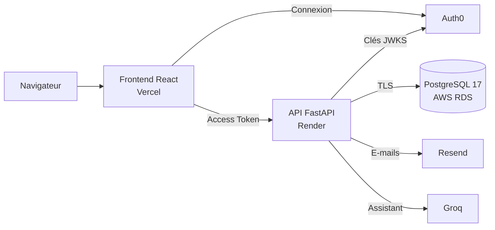

# Ndjoka Tontine

Ndjoka Tontine est une plateforme web de tontine digitale. Elle permet de
créer et gérer des groupes d'épargne rotative, de suivre les cotisations et
les versements, de trouver des tontines adaptées à son profil et d'être
accompagné par un assistant conversationnel.

Les cotisations et les versements sont déclaratifs : l'application organise
et trace les opérations, mais n'exécute aucun paiement.

## Fonctionnalités

- **Tontines** : création, modification, archivage, visibilité publique ou
  sur invitation.
- **Membres** : invitations par e-mail, rôles internes (`owner`, `manager`,
  `treasurer`, `member`), départ, retrait, transfert de propriété.
- **Cycles** : calendrier des tours de bénéficiaires, hebdomadaire ou mensuel.
- **Cotisations** : échéancier, déclaration par le membre, validation par les
  responsables, détection des retards.
- **Versements** : éligibilité, approbation, déclaration de paiement,
  confirmation de réception, contestation.
- **Profil d'épargnant et score de fiabilité** : capacité, rythme, objectif ;
  score calculé à partir de l'historique réel des cotisations.
- **Explorer** : tontines ouvertes classées par affinité avec le profil, et
  adhésion directe selon le score exigé par l'organisateur.
- **Ndjoka AI** : assistant qui répond à partir des données de l'utilisateur,
  en lecture seule.
- **Notifications** : notifications internes et e-mails transactionnels.
- **Audit** : historique immuable des actions sensibles.
- **Administration** : gestion des comptes, statuts et rôles globaux.

## Architecture



Auth0 authentifie l'utilisateur et délivre un Access Token. Le frontend
l'envoie à l'API, qui vérifie sa signature, son émetteur, son audience et son
expiration, puis applique les règles métier. PostgreSQL est la seule source
de vérité des données.

## Stack

| Couche | Technologies |
| --- | --- |
| Frontend | React 19, TypeScript, Vite, Tailwind CSS v4, shadcn/ui |
| Backend | Python 3.13, FastAPI, SQLAlchemy 2 (asyncpg), Alembic, Pydantic |
| Base de données | PostgreSQL 17 (Docker en local, AWS RDS en production) |
| Authentification | Auth0 (Universal Login, tokens RS256) |
| Services | Resend (e-mails), Groq (assistant) |
| Hébergement | Vercel (frontend), Render (API), Cloudflare (DNS) |

## Structure du dépôt

```text
backend/    API FastAPI, migrations et tests
frontend/   application React
infra/      PostgreSQL local (Docker) et exploitation de la base AWS RDS
```

| Documentation | Contenu |
| --- | --- |
| [backend/README.md](backend/README.md) | Configuration de l'API, architecture, modules, tests, migrations |
| [frontend/README.md](frontend/README.md) | Configuration du frontend, structure, build |
| [infra/README.md](infra/README.md) | Bases de développement, de test et de production, migrations RDS |

## Démarrage local

Prérequis : Docker, Python 3.13 avec [uv](https://docs.astral.sh/uv/),
Node.js 20.19+ ou 22.12+.

**1. Base de données**

```bash
cd infra
cp .env.example .env          # définir POSTGRES_PASSWORD
docker compose up -d postgres
```

**2. API**

```bash
cd backend
cp .env.example .env.dev      # renseigner Auth0 et DATABASE_URL
uv sync
uv run alembic upgrade head
uv run uvicorn app.main:app --reload
```

**3. Frontend**

```bash
cd frontend
cp .env.example .env.dev      # renseigner Auth0 et VITE_API_BASE_URL
npm install
npm run dev
```

| Service | URL locale |
| --- | --- |
| Frontend | `http://localhost:5173` |
| API | `http://127.0.0.1:8000` |
| Documentation OpenAPI | `http://127.0.0.1:8000/docs` |
| PostgreSQL | `127.0.0.1:5433`, base `ndjoka_db` |

## Production

| Service | URL |
| --- | --- |
| Frontend | `https://app.ndjoka-tontine.com` |
| API | `https://api.ndjoka-tontine.com` |
| Documentation OpenAPI | `https://api.ndjoka-tontine.com/docs` |
| Contrôle de santé | `https://api.ndjoka-tontine.com/api/v1/health` |

La branche de production est `develop`. Vercel et Render la déploient
automatiquement à chaque push.

### Render (API)

| Réglage | Valeur |
| --- | --- |
| Root Directory | `backend` |
| Build Command | `uv sync --locked --no-dev` |
| Start Command | `uv run --no-sync uvicorn app.main:app --host 0.0.0.0 --port $PORT` |
| Health Check Path | `/api/v1/health` |

Variables : `APP_ENV=prod`, `AUTH0_DOMAIN`, `AUTH0_AUDIENCE`,
`CORS_ALLOWED_ORIGINS`, `DATABASE_URL`, `EMAIL_PROVIDER=resend`,
`EMAIL_FROM_NAME`, `EMAIL_FROM_ADDRESS`, `EMAIL_CONTACT_ADDRESS`,
`FRONTEND_BASE_URL`, `RESEND_API_KEY`, `RESEND_WEBHOOK_SECRET`,
`GROQ_API_KEY`. Leur rôle est décrit dans le
[README backend](backend/README.md#configuration).

Le Web Service n'exécute ni les migrations ni les tâches planifiées :

- les migrations sont appliquées sur RDS avant le déploiement
  ([procédure](infra/README.md#appliquer-les-migrations)) ;
- le job de rappels (une fois par jour) et le worker de notifications
  (régulièrement) doivent être lancés par un ordonnanceur externe
  ([commandes](backend/README.md#déploiement)).

Sur l'offre gratuite, le service se met en veille après 15 minutes
d'inactivité ; la première requête suivante prend environ une minute.

### Vercel (frontend)

| Réglage | Valeur |
| --- | --- |
| Root Directory | `frontend` |
| Framework Preset | Vite |
| Build Command | `npm run build` |
| Output Directory | `dist` |

Variables : `VITE_AUTH0_DOMAIN`, `VITE_AUTH0_CLIENT_ID`,
`VITE_AUTH0_AUDIENCE`, `VITE_API_BASE_URL=https://api.ndjoka-tontine.com`.
Une modification de variable ne s'applique qu'au déploiement suivant.

### Auth0

Application de type **Single Page Application** :

```text
Allowed Callback URLs:  http://localhost:5173, https://app.ndjoka-tontine.com
Allowed Logout URLs:    http://localhost:5173, https://app.ndjoka-tontine.com
Allowed Web Origins:    http://localhost:5173, https://app.ndjoka-tontine.com
```

Custom API : identifier `https://api.ndjoka-tontine.com`, algorithme RS256.

Seuls ces domaines sont autorisés. Les URL générées par Vercel pour chaque
déploiement ne permettent pas de se connecter.

### Resend

Le domaine `ndjoka-tontine.com` doit être vérifié. Le webhook pointe vers
`https://api.ndjoka-tontine.com/api/v1/webhooks/resend` et écoute
`email.delivered`, `email.bounced`, `email.complained` et `email.failed`.

### Mise en production d'une version

1. Si la version contient une migration, l'appliquer sur RDS
   ([procédure](infra/README.md#appliquer-les-migrations)).
2. Pousser sur `develop` et attendre la fin des déploiements Render et Vercel.
3. Vérifier :

   ```bash
   curl -i https://api.ndjoka-tontine.com/api/v1/health    # 200
   curl -i https://api.ndjoka-tontine.com/api/v1/me        # 401 sans token
   ```

4. Se connecter sur `https://app.ndjoka-tontine.com` et vérifier le chargement
   du tableau de bord. C'est le seul contrôle qui valide toute la chaîne
   Auth0, API et base de données.

## Sécurité

- Seuls les fichiers `.env.example` sont versionnés. Les fichiers `.env`,
  `.env.dev` et `.env.prod` restent locaux.
- Les secrets (URL de base, clés Resend et Groq) sont stockés dans les
  variables privées de Render.
- Les variables `VITE_*` sont publiques : elles ne contiennent aucun secret.
- L'API valide les tokens avec les clés publiques d'Auth0 ; aucun Client
  Secret n'est nécessaire.
- Le rôle `platform_admin` s'attribue uniquement en base, par `auth0_sub`
  exact ([procédure](infra/README.md#désigner-le-premier-administrateur)).

## Dépannage

| Symptôme | Cause probable | Correction |
| --- | --- | --- |
| `Callback URL mismatch` | Domaine non déclaré dans Auth0 | Utiliser `app.ndjoka-tontine.com`, ou déclarer l'origine dans les trois listes Auth0 |
| `Failed to fetch` en local | API arrêtée | Lancer Uvicorn sur `127.0.0.1:8000` |
| `Failed to fetch` en production | API en veille ou origine absente du CORS | Attendre le réveil, vérifier `CORS_ALLOWED_ORIGINS` |
| `401` avec un token | Audience, domaine ou expiration invalide | Comparer la configuration Auth0 du frontend et de l'API |
| `403` avec un token valide | Compte suspendu ou désactivé, rôle insuffisant | Vérifier `status` et `global_role` de l'utilisateur |
| `500`, colonne ou table inexistante | Migration non appliquée | `alembic current`, puis `alembic upgrade head` sur la bonne base |
| Build Vercel en échec, module introuvable, alors que le build local passe | Fichier source ignoré par Git | `git check-ignore -v <fichier>` et corriger `.gitignore` |
| Variable Vercel sans effet | Déploiement antérieur à la modification | Redéployer |
